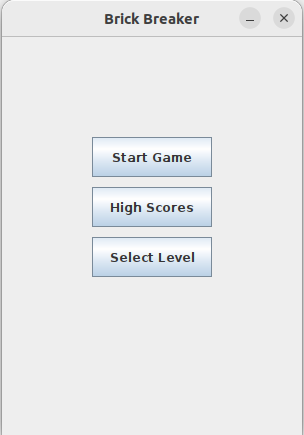
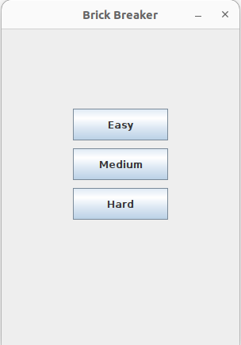
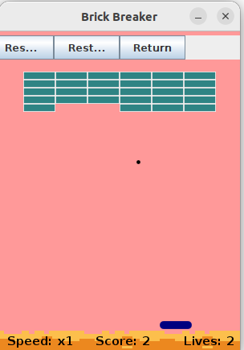

# Brick Breaker Java Game

## Overview
Brick Breaker is a classic arcade game implemented in Java. Players control a paddle to bounce a ball and break bricks, aiming to clear all bricks without letting the ball fall.

## Features
- Classic brick-breaking gameplay
- Scoring system
- Multiple levels
- Adjustable game settings

## Installation
1. Clone the repository:
    ```sh
    git clone https://github.com/syedowaisalishah/Brick_Breaker_Java_Game.git
    ```
2. Navigate to the project directory:
    ```sh
    cd Brick_Breaker_Java_Game
    ```
3. Compile the game:
    ```sh
    javac BrickBreaker/*.java
    ```
4. Run the game:
    ```sh
    java BrickBreaker.Main
    ```

## How to Play
- Use the left and right arrow keys to move the paddle.
- Break all the bricks to advance to the next level.
- Don't let the ball fall below the paddle.

### Home Screen


### Select Level


### Game Board



## Contributing
1. Fork the repository.
2. Create a new branch (`git checkout -b feature-branch`).
3. Commit your changes (`git commit -am 'Add new feature'`).
4. Push to the branch (`git push origin feature-branch`).
5. Create a new Pull Request.

## License
This project is licensed under the MIT License.

## Contact
For any questions or feedback, please open an issue in the repository.
